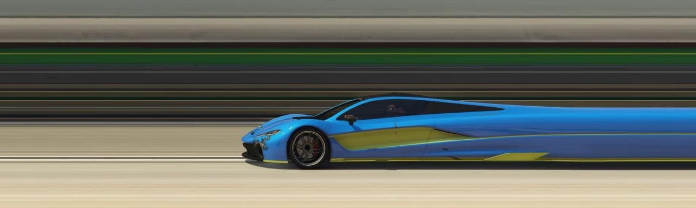

# Standard Readme

This repository contains program for doing slit photography. It provides user interface, quite good perfomance to try this genre of photography.

Tested on:

- Windows 10
- Linux



## Table of Contents

- [Background](#background)
- [Install](#install)
- [Usage](#usage)
- [Contributing](#contributing)
- [License](#license)

## Background

Read [wiki article](https://en.wikipedia.org/wiki/Slit-scan_photography) about slit-scan photography for basic understanding what it is.

## Install

You have **two options** here: to download pre-prepared files for your system from this source (easy way) **or** you can clone this repository, install all required 
libraries and run .py file derectly (more complicated way).

### Easy way

Download zip-folder for your system, than unpack wherever you want and run .exe file if you are using Windows or run ./executable_file_name on Linux. On Linux 
it may be necessary to make the file executable like this:

```sh
$ sudo chmod -x executable_file_name
```

### Complex way

Clone this repository:

```sh
$ git clone https://github.com/neon-softhamster/slitphoto.git
```

Go folder slitphoto
```sh
cd slitphoto
```

Install libs listed in requirements.txt using pip
```sh
pip install -r requirements.txt
```

## Usage

Run and use. A detailed description of using the program will appear later in this section.


## Contributing

Feel free to dive in! Or if you find out some issue (which, in fact, there are still a lot) open thread [here](https://github.com/neon-softhamster/slitphoto/issues).


## License

Use it as you want © Me